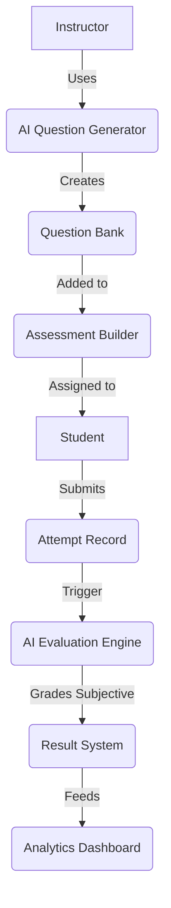

# PROJECT IMPLEMENTATION AUDIT
**Master Product Vision vs Current Repository State**

This document serves as a Principal Architect-level review of the LMS-Assess platform. It contrasts the original, ambitious product vision against the actual, current repository implementation, identifying gaps, technical debt, and the recommended roadmap forward.

---

## SECTION 1 - IMPLEMENTED FEATURES & CURRENT STATUS

After scanning the complete repository (Frontend `src/pages`, Backend `src/models`, `src/controllers`, and AI module `src/ai`), the feature status is as follows:

### Core Platform
- **Authentication (JWT):** Implemented (Production Ready).
- **Role Management:** Implemented (Admin, Instructor, Student).
- **Dashboard System:** Implemented (Student and Instructor views exist).
- **Settings & Profiles:** Implemented.
- **Messaging/Notifications:** Partially Implemented (Schemas exist, frontend placeholder UI exists, real-time socket integration is missing).

### Assessment Module
- **Question Bank:** Implemented.
- **Manual Question Creation:** Implemented.
- **Assessment Builder:** Implemented.
- **Student Exam Flow (Timer, Navigation):** Implemented.
- **Result System:** Implemented.

### AI Platform
- **Provider Layer (ProviderFactory):** Implemented (Groq currently integrated).
- **Prompt Registry:** Implemented.
- **AI Question Generator:** Implemented (Frontend `QuestionGeneration.jsx` wired to backend `aiService`).
- **AI Evaluation (Theory/Subjective):** Partially Implemented (Foundation exists in models, endpoints need final rubric mapping).
- **AI Logging & Tracking:** Implemented (`AIEvaluationLog.js`, `AIUsageMetrics.js`).
- **RAG Knowledge Base:** Placeholder / Not Started.
- **Career / Learning / Interview Assistant:** Placeholder / Future Modules.

---

## SECTION 2 - IMPLEMENTATION MATRIX

| Feature | Frontend | Backend | Database | AI | Status | Completion % |
| :--- | :--- | :--- | :--- | :--- | :--- | :--- |
| **Authentication** | ✅ Done | ✅ Done | ✅ Done | - | Production Ready | 100% |
| **Assessment Builder** | ✅ Done | ✅ Done | ✅ Done | - | Production Ready | 95% |
| **Question Bank** | ✅ Done | ✅ Done | ✅ Done | - | Production Ready | 100% |
| **AI Question Gen** | ✅ Done | ✅ Done | ✅ Done | ✅ Done | Production Ready | 90% |
| **AI Subjective Eval** | 🚧 WIP | 🚧 WIP | ✅ Done | ✅ Done | Partially Implemented | 60% |
| **Messaging** | 🚧 WIP | 🚧 WIP | ✅ Done | - | Partially Implemented | 40% |
| **Analytics/Reports** | 🚧 WIP | 🚧 WIP | 🚧 WIP | - | Missing Advanced Metrics | 50% |
| **RAG Knowledge Base**| ❌ No | ❌ No | ✅ Done | ❌ No | Not Started | 10% |
| **Multi-Agent Chatbots**| ❌ No | ❌ No | ❌ No | ❌ No | Future Scope | 0% |

---

## SECTION 3 - DEVELOPMENT TIMELINE

Based on Git history and architectural layering, the project evolved as follows:

1. **Foundation & Setup:** Monorepo initialization, `.env` management, server setup.
2. **Database Schema Design:** Extensive MongoDB schema creation (Users, Assessments, Attempts).
3. **Authentication:** JWT, Role-based routing, Password hashing.
4. **Assessment Module:** CRUD for assessments, student exam flow logic.
5. **AI Platform Architecture (Phase 1):** ProviderFactory, PromptRegistry, BaseProvider.
6. **AI Question Generator (Phase 2):** Wiring AI models to dynamically generate JSON questions.
7. **Frontend Integration:** Connecting React UI (`QuestionGeneration.jsx`) to backend APIs.
8. **Current Stage:** Stabilization of core features, preparing for Subjective AI Evaluation and Real-Time messaging.

---

## SECTION 4 - AI IMPLEMENTATION REVIEW

The AI module (`lms-backend/src/ai`) is the most sophisticated architectural component in the repository. 

**What works:**
- **Provider Abstraction:** `ProviderFactory` successfully abstracts the underlying LLM. Currently configured for Groq via `AI_DEFAULT_PROVIDER`.
- **Question Generation:** Instructors can request questions by topic. The `PromptRegistry` fetches the system prompt, enforces a strict JSON schema, and the `GroqProvider` executes it. The response is parsed and validated before being saved.
- **AI Logging:** Every prompt and response is logged in `AIEvaluationLog` for auditing and cost-tracking.

**What is missing/placeholder:**
- OpenAI integration (Provider class needs implementation).
- The actual execution of the RAG Knowledge base (Document parsing, vector embeddings).
- Subjective auto-evaluation endpoints are partially wired but lack robust rubric enforcement testing.

---

## SECTION 5 - GAP ANALYSIS

**Completed:**
- Core CRUD, Auth, Assessment Taking, AI Question Generation.

**Incomplete / Technical Debt:**
- **AI Evaluation:** The database model `Result` and `Attempt` exist, but the AI trigger mechanism for grading long-form answers needs hardening.
- **Real-Time Websockets:** Messaging and Notifications rely on polling or are static placeholders. Needs `Socket.io`.
- **Pagination & Caching:** Heavy endpoints (like fetching all question banks) lack pagination and Redis caching, posing scalability risks.

**Blocked:**
- **Multi-Agent Chatbots:** Blocked until RAG architecture (Vector DB like Pinecone or native MongoDB Atlas Vector Search) is implemented.

---

## SECTION 6 - FEATURE RELATIONSHIP DIAGRAMS

### Assessment & AI Evaluation Flow

---

## SECTION 7 - ARCHITECTURAL ROADMAP (WHAT TO BUILD NEXT)

As a Principal Architect, here is the exact order of implementation required to bring this platform to enterprise maturity:

### 1. Finalize AI Subjective Evaluation (High Priority)
- **Why:** Auto-grading is the second half of the core value proposition. Question generation is useless if instructors still have to manually grade 500 essays.
- **Dependencies:** Attempt tracking (Done), AI Provider (Done).
- **Changes Needed:** Create `/api/ai/evaluate-attempt` route. Update `Result.js` to store AI feedback alongside the score.

### 2. Implement Redis Caching & Rate Limiting (Medium Priority)
- **Why:** The AI endpoints are expensive and slow. Caching generated questions and rate-limiting AI requests per user is critical for production cost-control.
- **Changes Needed:** Add Redis. Wrap AI controllers with caching middleware.

### 3. Implement Websockets for Notifications (Medium Priority)
- **Why:** Assessment assignments and AI evaluation completions should notify users instantly.
- **Changes Needed:** Integrate `Socket.io`. 

### 4. RAG Knowledge Base (Strategic / Future Priority)
- **Why:** To enable the "Learning Assistant" chatbot, the AI needs context about the specific university/course materials.
- **Changes Needed:** Implement MongoDB Vector Search. Create endpoints to upload PDFs, chunk text, and generate embeddings.

---

## SECTION 8 - IMPLEMENTATION PROGRESS ESTIMATE

- **Database %:** 90%
- **Backend Core %:** 85%
- **Authentication %:** 100%
- **Frontend Core %:** 80%
- **AI Engine %:** 75%
- **Analytics %:** 40%
- **OVERALL PRODUCTION READINESS:** **~75%**

*The platform is highly functional as a standard LMS with AI-assisted authoring. The final 25% requires hardening the AI evaluation pipelines and implementing real-time scale optimizations.*
