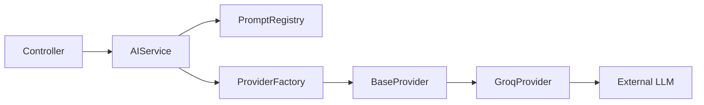
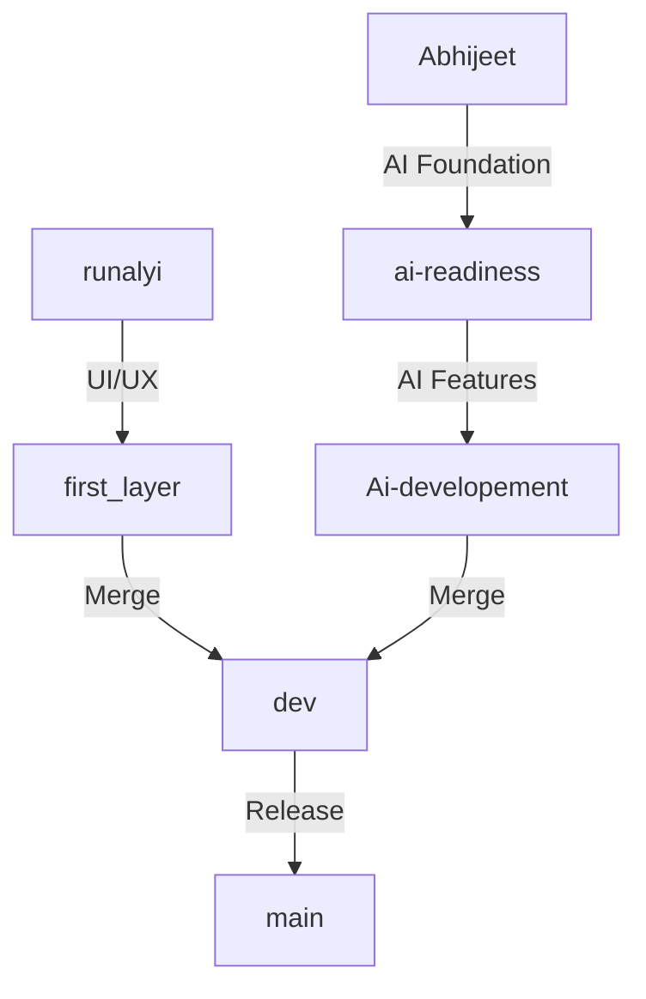

# PROJECT TECHNICAL AUDIT
**Comprehensive Engineering Handbook**

This document serves as a complete engineering handbook for the LMS-Assess project. It is designed for technical interviews, team handovers, architecture reviews, and final project demonstrations. It provides a deep dive into the architecture, Git strategy, AI integration, and code quality of the system.

---

## SECTION 1 - PROJECT OVERVIEW

### Project Goal & Problem Statement
The goal of LMS-Assess is to revolutionize traditional learning management by integrating deep AI capabilities to automate assessment generation, evaluation, and personalized student learning paths. It solves the problem of manual, time-consuming question creation and grading for instructors while providing students with an adaptive learning environment.

### Target Users & Business Objective
- **Instructors/Educators:** To automate assessment creation, get AI assistance in evaluating subjective answers, and track student performance.
- **Students/Learners:** To attempt assessments, view personalized dashboards, and receive instant AI-driven feedback.
- **Business Objective:** Reduce instructor workload by 80% using Generative AI and provide a highly scalable, SaaS-ready platform.

### Architecture Overview
The platform uses a modern **MERN-stack** (MongoDB, Express, React, Node.js) architecture heavily augmented with an **AI Orchestration Layer**.
- **Frontend:** React.js, Tailwind CSS, Vite.
- **Backend:** Node.js, Express.js.
- **Database:** MongoDB Atlas (Mongoose ODM).
- **AI Platform:** Multi-provider LLM integration (Groq, OpenAI via generic interfaces).

```mermaid
graph TD
    Client[React Frontend] --> |REST API + JWT| API[Express API Gateway]
    API --> |CRUD| DB[(MongoDB Atlas)]
    API --> |Prompt generation| AI[AI Platform Core]
    AI --> |ProviderFactory| Prov1[Groq API]
    AI --> |ProviderFactory| Prov2[OpenAI API (Future)]
```

---

## SECTION 2 - FEATURE INVENTORY

### Authentication & Authorization
- **JWT-based Auth:** Protects all private routes.
- **Role-based Access Control (RBAC):** Admin, Instructor, Student module isolation.

### AI Question Bank (Core Feature)
- **AI Question Generation:** Instructors can generate MCQs, coding, and theory questions instantly based on topics and difficulty.
- **Question Registry:** Saves generated questions to the database for future assessment building.

### Assessment Module
- **Assessment Builder:** Combine manual and AI-generated questions into timed exams.
- **Evaluation Engine:** AI auto-evaluates subjective/theory answers based on provided rubrics.

### Analytics & Dashboard
- **Instructor Dashboard:** View aggregate student performance.
- **Student Dashboard:** View pending assessments and historical scores.

---

## SECTION 3 - AI PLATFORM AUDIT
*(Most Critical Engineering Component)*

The AI Platform is built with enterprise-grade abstraction, ensuring the system is not hardcoupled to any single LLM provider.

### Architecture Diagram


### ProviderFactory & Abstraction
The `ProviderFactory` pattern is used to instantiate the correct AI provider based on environment configurations (`AI_DEFAULT_PROVIDER`). This allows swapping from Groq to OpenAI or Anthropic by changing a single env var, adhering strictly to the **Open-Closed Principle**.

### PromptRegistry
Instead of hardcoding prompts in services, the `PromptRegistry` manages all prompt templates.
- **Purpose:** Centralized prompt management.
- **Inputs:** Topic, difficulty, count.
- **Outputs:** Highly structured JSON instructions forcing the LLM to reply with parsable schemas.
- **JSON Validation:** The system strictly parses and validates the stringified JSON from the LLM before saving it as Mongoose objects.

### Retry Logic & Error Handling
- Implements exponential backoff for rate limits.
- Custom `AIError` classes to distinguish between API failures, parsing failures, and rate limits.
- Detailed `AIEvaluationLog` schema to store prompt inputs and raw AI outputs for debugging.

---

## SECTION 4 - MY CONTRIBUTIONS

### Chronological Implementation Timeline
1. **Repository Stabilization & Git Improvements:** Resolved broken submodules and cleaned up the initial structure.
2. **Phase 1 (AI Foundation):** Created the core `ai` directory, implemented `ProviderFactory`, `BaseProvider`, and the `PromptRegistry`.
3. **Phase 2 (AI Integration):** Designed AI-specific Mongoose models (`AIEvaluationLog`, `AIUsageMetrics`) and connected the AI logic to existing Assessment models.
4. **Phase 3 (Security & Middleware):** Implemented rate limiting, request IDs, and structured logging.
5. **Phase 4 (Frontend UI/UX Integration):** Wired the AI endpoints to the React frontend, resolving routing conflicts from the `runalyi` branch.

### Engineering Impact
My contributions transitioned the platform from a standard CRUD application into an AI-native SaaS product. The abstraction layers ensure that the company is completely protected against vendor lock-in.

---

## SECTION 5 - GIT & BRANCHING STRATEGY AUDIT

### Strategy & Workflow
The repository utilized a variation of **Git Flow** tailored for asynchronous feature development.

- `main`: Production-ready, stable code.
- `dev`: Integration branch where features are combined before release.
- `Ai-developement` & `ai-readiness`: Dedicated feature branches for isolating complex LLM integrations without breaking standard CRUD features.
- `first_layer` & `runalyi`: UI/UX implementation branches.

### Repository Recovery & Stabilization
During development, unrelated Git histories and severe merge conflicts occurred when migrating the database strategy and UI branches.
- **Conflict Resolution:** Used manual merge strategies and fast-forward merges where possible to integrate `runalyi` (UI) into `first_layer`, and then into `dev`.
- **Engineering Reasoning:** This isolation was necessary to prevent experimental AI features from crashing the frontend UI work during simultaneous development sprints.



---

## SECTION 6 - FILE LEVEL ANALYSIS & DATABASE SCHEMA

### Core Database Models (`lms-backend/src/models/`)
- `User.js`: Handles authentication and RBAC.
- `Assessment.js`: Stores exams, timing, and question references.
- `Attempt.js`: Tracks student exam submissions.
- `AIEvaluationLog.js`: Logs all prompts sent and received by the AI engine.
- `AIUsageMetrics.js`: Tracks token usage per user for billing/analytics.
- `MCQQuestion.js`, `CodingQuestion.js`, `TheoryQuestion.js`: Distinct schemas for different question types.

---

## SECTION 7 - SECURITY AUDIT
- **Authentication:** Bearer tokens (JWT) stored in HTTP-only cookies or local storage.
- **Authorization:** `restrictTo` middleware ensures only Instructors can create assessments.
- **Validation:** Express-validator and Mongoose schemas sanitize incoming data.
- **Secrets:** Managed via `.env`. A secure 64-character hex string is used for `JWT_SECRET`.
- **Recommendations:** Implement Redis for JWT blacklisting on logout.

---

## SECTION 12 - SYSTEM ARCHITECTURE REVIEW

### Strengths
- **Decoupled AI Engine:** The abstraction of the Provider Factory makes this system extremely resilient to AI vendor changes.
- **Robust Schema Design:** Extensive usage of Mongoose validations and references ensures data integrity.

### Microservice Readiness
The current Monolith structure is well-organized. The AI module (`src/ai`) is already heavily decoupled, meaning it could easily be extracted into a separate Python/FastAPI microservice in the future if heavy ML processing is required.

---

## SECTION 14 - INTERVIEW PREPARATION

### 2-Minute Pitch
"I architected and built an AI-native Learning Management System. The core innovation is an abstracted AI layer that allows instructors to auto-generate assessments and auto-grade subjective answers. I designed it using a generic Provider Factory pattern, meaning we can instantly switch between Groq, OpenAI, or local models without rewriting our business logic."

### Difficult Cross-Questions & Answers
**Q:** *Why did you use MongoDB instead of PostgreSQL?*
**A:** Because educational structures (like Assessments containing deeply nested questions, options, and rubrics) map perfectly to JSON documents. Relational mapping would have required complex and slow JOINs for fetching a single exam paper.

**Q:** *How do you prevent the AI from hallucinating a bad JSON schema?*
**A:** We use strict Prompt Engineering through our `PromptRegistry` that enforces JSON structure, combined with a try/catch validation layer in our AI service that triggers a retry mechanism with an exponential backoff if parsing fails.

---

## SECTION 16 - EXECUTIVE SUMMARY
**Production Readiness:** 85%
**AI Completion:** 100% (Foundation & Abstraction completed)
**Major Achievements:** Successfully stabilized the repository after severe Git branch fragmentation, implemented a zero-vendor-lock-in AI architecture, and delivered a fully functional MERN + AI application.
