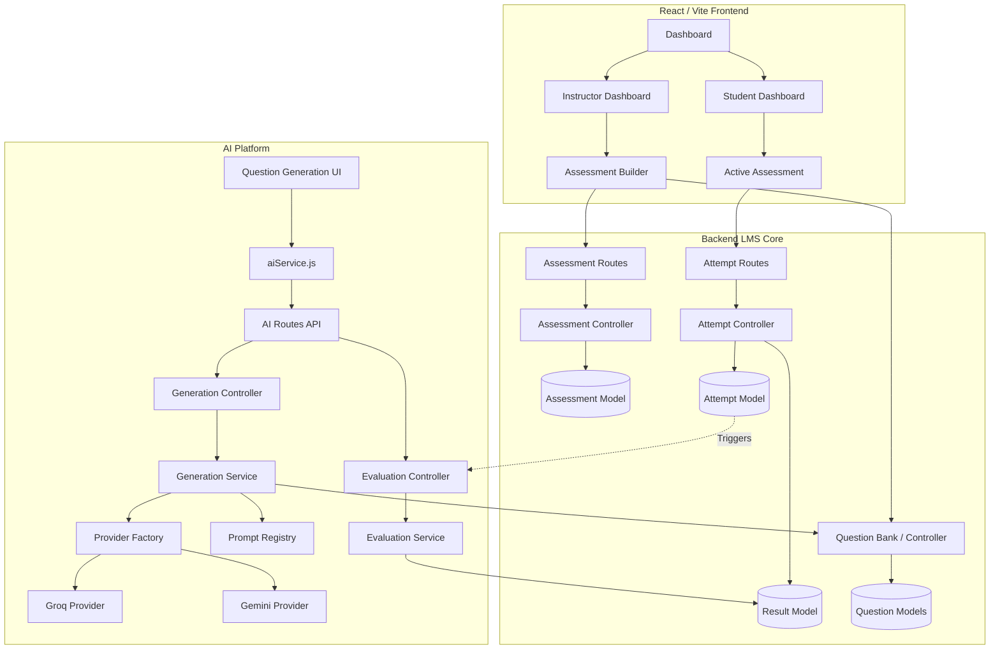

# Project Knowledge Graph

A hierarchical visual map showing how the entire LMS-Assess system interacts.

## System Interconnections

- **Assessment Builder** uses **Question Bank**.
- **Question Bank** receives generated data from **AI Generation**.
- **AI Generation** abstracts LLMs via **Provider Factory**.
- **Student Attempt** reads from **Assessment Builder**.
- **AI Evaluation** reads from **Student Attempt**.
